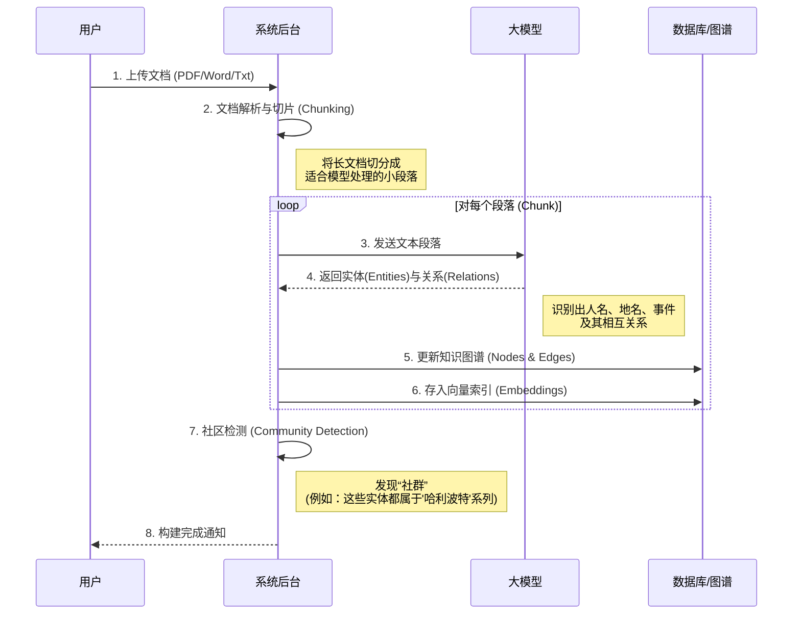

# 1. 系统概览 (System Overview)

本文档旨在为非技术人员（如产品经理、业务分析师）提供 **Youtu-GraphRAG** 系统的全貌概览。我们将通过可视化图表展示数据如何在系统中流动，以及用户如何与系统交互。

## 核心价值

Youtu-GraphRAG 是一个 **基于知识图谱的检索增强生成 (Graph RAG)** 系统。简单来说，它不仅仅像传统搜索引擎那样通过关键词找文档片段，而是构建了一张“知识网络”，理解实体（人、事、物）之间的关系，从而能够回答复杂的推理问题。

---

## 🏗️ 系统架构图 (System Architecture)

下图展示了系统的主要模块及其交互关系。

```mermaid
graph TB
    subgraph "前端交互层 (Frontend)"
        User[用户 (Product Manager/User)]
        UI[Web 界面 / 命令行]
        User -->|上传文档| UI
        User -->|提出问题| UI
    end

    subgraph "核心业务层 (Backend API)"
        API[FastAPI 服务端]
        Controller[业务逻辑控制器]
        UI <-->|HTTP/WebSocket| API
        API --> Controller
    end

    subgraph "智能处理引擎 (Models)"
        direction TB
        Constructor[🏗️ 图谱构建器 (Constructor)]
        Retriever[🔍 智能检索器 (Retriever)]
        LLM[🧠 大语言模型 (LLM Agent)]

        Controller -->|触发构建| Constructor
        Controller -->|触发问答| Retriever
        Retriever <-->|推理与生成| LLM
        Constructor <-->|实体抽取| LLM
    end

    subgraph "数据存储层 (Storage)"
        RawData[(📂 原始文档)]
        GraphDB[(🕸️ 知识图谱 NetworkX)]
        VectorDB[(🔢 向量数据库 FAISS)]
        Cache[(💾 缓存系统)]

        Constructor -->|存入| GraphDB
        Constructor -->|存入| VectorDB
        Constructor -->|读取| RawData
        Retriever -->|查询| GraphDB
        Retriever -->|查询| VectorDB
        Retriever <-->|读写| Cache
    end

    style User fill:#f9f,stroke:#333,stroke-width:2px
    style LLM fill:#ff9,stroke:#f66,stroke-width:2px
    style GraphDB fill:#bbf,stroke:#333,stroke-width:2px
```

### 模块说明

1.  **前端交互层**: 用户操作界面。支持文件上传（PDF/Word/Txt）和自然语言问答。
2.  **核心业务层**: 系统的“大脑”，负责接收请求、调度任务。它决定了什么时候通过“构建器”处理文档，什么时候通过“检索器”回答问题。
3.  **智能处理引擎**:
    *   **构建器 (Constructor)**: 负责“读懂”文档，将其转化为知识图谱（实体与关系）。
    *   **检索器 (Retriever)**: 负责“思考”问题，在图谱中寻找答案。
    *   **LLM (大模型)**: 系统的推理核心，负责从文本中提取信息和生成最终答案。
4.  **数据存储层**:
    *   **原始文档**: 用户上传的文件。
    *   **知识图谱**: 存储实体（如“乔布斯”）和关系（如“创立了苹果公司”）。
    *   **向量数据库**: 存储文本的数学表示，用于模糊搜索（比如搜“手机”能关联到“iPhone”）。

---

## 🔄 核心业务流程 (Business Workflows)

系统主要包含两条核心业务线：**知识构建 (Write)** 和 **智能问答 (Read)**。

### 1. 知识构建流程 (从文档到图谱)

这是“教”系统知识的过程。



### 2. 智能问答流程 (从问题到答案)

这是向系统“提问”的过程。我们支持 **Agent (智能体)** 模式，能够进行多步推理。

```mermaid
flowchart TD
    Start([用户提问]) --> Decompose[🧩 问题拆解]
    note1[例如：'A和B有什么关系？'<br/>拆解为：'A是谁？' + 'B是谁？' + '由于...'] -.-> Decompose

    Decompose --> SubQ{是否有子问题?}

    SubQ -- 是 --> ParallelSearch[⚡ 并行检索子问题]
    SubQ -- 否 --> DirectSearch[🔍 直接检索]

    ParallelSearch --> Context[📚 汇总知识背景]
    DirectSearch --> Context

    Context --> Reason[🤔 LLM 推理 (CoT)]

    Reason --> Check{信息足够吗?}

    Check -- 不够 --> NewQuery[生成新查询词]
    NewQuery --> IterativeSearch[🔄 再次检索图谱]
    IterativeSearch --> Context

    Check -- 足够 --> Answer([💡 生成最终答案])

    style Start fill:#9f9,stroke:#333
    style Answer fill:#9f9,stroke:#333
    style Reason fill:#ff9,stroke:#f66
```

## 🌟 关键特性 (Key Features)

*   **Agentic / No-Agent 模式切换**:
    *   **Agent 模式**: 就像一个侦探，会把大问题拆成小问题，一步步寻找线索（适合复杂推理）。
    *   **No-Agent 模式**: 就像一个快手，直接根据关键词搜索最相似的内容（适合简单查询，速度快）。
*   **模式演化 (Schema Evolution)**:
    *   系统在构建图谱时，如果发现了预定义规则之外的新类型实体（例如从未见过的“魔法道具”），它会智能地扩展自己的认知范围，而不是忽略它。

---
*接下来，请阅读 [2. 知识图谱构建详解](2_graph_construction.md) 以深入了解数据是如何被“理解”的。*
