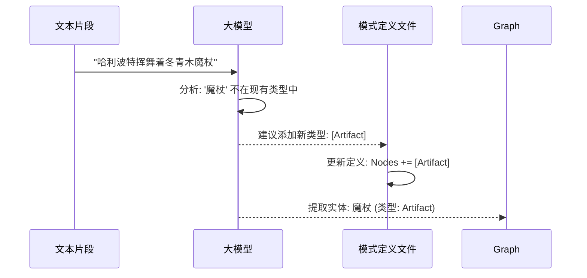

# 2. 知识图谱构建详解 (Knowledge Graph Construction)

本文档深入剖析 Youtu-GraphRAG 如何将非结构化的文本（如小说、财报、技术文档）转化为结构化的知识图谱。这是系统最核心的“学习”过程。

## 🌐 核心流程图 (Construction Pipeline)

整个构建过程由 **构建器 (Constructor)** 驱动，主要分为以下几个关键步骤。

```mermaid
graph TD
    Start([📂 上传文档]) --> Chunking[✂️ 文本分块 (Chunking)]

    subgraph "并行处理 (Parallel Processing)"
        Chunking --> ProcessChunk[🔄 处理每个文本块]

        ProcessChunk --> Prompt[📝 构建提示词 (Prompt Construction)]
        Prompt --> LLM[🧠 大模型调用 (LLM Call)]

        LLM --> Parse[解析 JSON 响应]

        Parse --> Extract{提取内容}
        Extract -->|实体| Entity[👤 Nodes (节点)]
        Extract -->|关系| Relation[🔗 Edges (边)]
        Extract -->|属性| Attribute[📋 Attributes (属性)]

        subgraph "Agent 模式特有 (Schema Evolution)"
            Extract -->|新类型?| NewSchema[💡 模式演化 (New Schema Types)]
            NewSchema --> UpdateSchema[更新全局 Schema 文件]
        end
    end

    Entity --> GraphBuilder[🏗️ 组装子图]
    Relation --> GraphBuilder
    Attribute --> GraphBuilder

    GraphBuilder --> NetworkX[(🕸️ 全局图谱 NetworkX)]
    GraphBuilder --> VectorStore[(🔢 向量索引 FAISS)]

    NetworkX --> Community[🏘️ 社区检测 (Community Detection)]
    Community --> SuperNodes[⭐ 生成超级节点 (Super Nodes)]

    SuperNodes --> FinalSave([💾 保存最终图谱])

    style Start fill:#f9f,stroke:#333
    style LLM fill:#ff9,stroke:#f66
    style NewSchema fill:#f96,stroke:#333
    style Community fill:#9cf,stroke:#333
```

---

## 🔍 关键步骤解析

### 1. 文本分块 (Chunking)

由于大模型有输入长度限制（Token Limit），我们不能一次性塞入整本书。
*   **动作**: 将文档切分为较小的片段（Chunk）。
*   **策略**:
    *   `chunk_size`: 每个片段的大小（例如 1000 字符）。
    *   `overlap`: 片段之间的重叠部分（例如 200 字符），防止上下文丢失。
    *   **特殊数据集**: 对于某些特定的数据集（如 `hotpot`, `2wiki`），系统会采取不分块策略以保持完整性。

### 2. 实体与关系抽取 (Information Extraction)

这是最智能的一步。系统通过 Prompt（提示词）告诉 LLM：“请帮我找出这段话里的人、事、物，以及它们之间的关系。”

*   **输入**: 一个文本片段（Chunk）。
*   **输出**: 标准化的 JSON 数据，包含：
    *   **Nodes (实体)**: `["Harry Potter", "Hogwarts"]`
    *   **Relations (关系)**: `["Harry Potter", "attends", "Hogwarts"]`
    *   **Attributes (属性)**: `{"Harry Potter": ["occupation: wizard", "house: Gryffindor"]}`

#### 💡 模式演化 (Schema Evolution) - Agent 模式的魔法

在 **Agent 模式** 下，系统具备自我进化的能力。

*   **场景**: 假设预定义的 Schema（规则）只包含“人”和“地点”。
*   **发现**: 文档中出现了“魔杖”和“隐身衣”。
*   **动作**:
    1.  LLM 识别出这些是新类型（Nodes: "Artifact"）。
    2.  LLM 建议将 "Artifact" 加入 Schema。
    3.  系统自动更新 `schemas/*.json` 文件。
    4.  未来的提取将自动兼容这些新类型。



### 3. 图谱组装 (Graph Assembly)

将所有片段提取出的碎片信息拼凑成一张大网。

*   **节点合并**: 如果片段 A 提到 "Apple" (Organization)，片段 B 也提到 "Apple"，它们会被合并为同一个节点。
*   **关系去重**: 相同的关系会被合并，避免冗余。
*   **向量化**: 为每个节点生成向量（Embedding），方便后续通过语义相似度进行检索（例如搜“水果公司”能找到“Apple”）。

### 4. 社区检测 (Community Detection)

当图谱变得庞大时，我们需要找出其中的“圈子”。

*   **算法**: 使用 `Tree-Comm` 算法。
*   **目的**: 将联系紧密的节点聚类（例如“食死徒”作为一个社区，“凤凰社”作为另一个社区）。
*   **产出**: 生成 **超级节点 (Super Nodes)**。这些超级节点是对整个社区的摘要，能够帮助回答跨越多实体的高层级问题。

---

## 📁 数据流向 (Data Flow)

| 阶段 | 输入 | 处理逻辑 | 输出 | 存储位置 |
| :--- | :--- | :--- | :--- | :--- |
| **上传** | PDF/Word | `document_parser` | 纯文本 | `data/uploaded/` |
| **切片** | 纯文本 | `chunk_text` | Chunks | `output/chunks/` |
| **提取** | Chunks | `extract_with_llm` | JSON (实体/关系) | 内存 / 临时文件 |
| **构建** | JSON | `KTBuilder` | NetworkX Graph | `output/graphs/` |
| **索引** | Graph | `SentenceTransformer` | FAISS Index | `retriever/faiss_cache_new/` |

---
*了解了图谱是如何建立的之后，请继续阅读 [3. 智能检索与推理](3_retrieval_and_reasoning.md) 了解我们如何利用这张图谱回答问题。*
