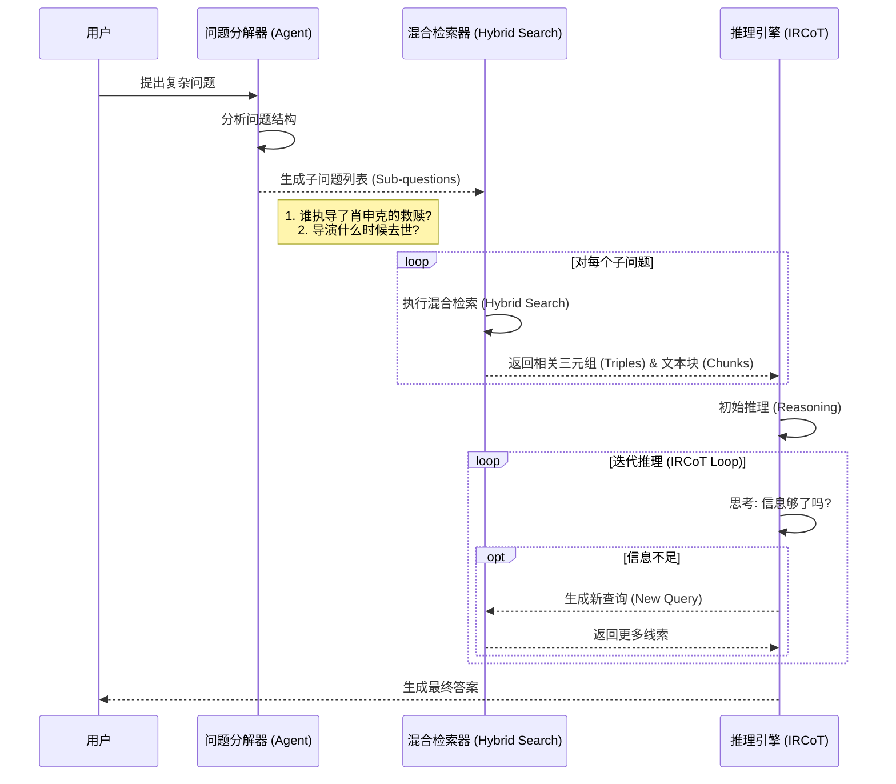
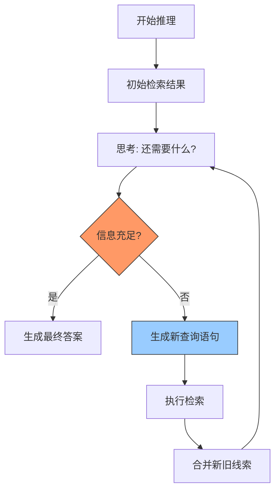

# 3. 智能检索与推理 (Retrieval and Reasoning)

本文档将详细介绍 Youtu-GraphRAG 如何通过智能体 (Agent) 技术，从庞大的知识图谱中精准定位答案。

## 🎯 核心流程图 (Retrieval Pipeline)

当用户提出一个复杂问题（例如：“谁执导了那部基于斯蒂芬·金小说的电影，他什么时候去世的？”）时，系统会启动以下流程。



---

## 🔍 混合检索引擎 (Hybrid Retrieval Engine)

为了确保不漏掉任何蛛丝马迹，我们在底层使用了四种并行的检索策略。

```mermaid
mindmap
  root((混合检索策略))
    路径1: 向量检索 (Vector Search)
      语义匹配
      FAISS 索引
      找相似节点/关系
    路径2: 关键词检索 (Keyword Search)
      精确匹配
      SpaCy 实体识别
      找特定专有名词
    路径3: 三元组检索 (Triple Retrieval)
      结构化匹配
      直接找关系链
      (A)-[关系]->(B)
    路径4: 文本块检索 (Chunk Retrieval)
      原始文本回溯
      找上下文细节
      作为补充证据
```

### 1. 向量检索 (Vector Search)
*   **原理**: 将问题转化为数学向量，在多维空间中寻找距离最近的实体。
*   **优势**: 即使问题中用词不准确（如同义词），也能找到相关内容。

### 2. 关键词检索 (Keyword Search)
*   **原理**: 提取问题中的关键实体（如人名、地名），直接在图谱中定位。
*   **优势**: 精确度高，适合查找特定事实。

### 3. 三元组检索 (Triple Retrieval)
*   **原理**: 直接搜索图谱中的“主语-谓语-宾语”结构。
*   **优势**: 能捕捉到实体间的直接关系。

### 4. 文本块检索 (Chunk Retrieval)
*   **原理**: 回溯到构建图谱时的原始文本片段。
*   **优势**: 提供丰富的上下文信息，弥补图谱结构化信息的不足。

---

## 🧠 智能体迭代推理 (IRCoT)

这是系统最像人类思考的部分：**Iterative Retrieval with Chain-of-Thought (IRCoT)**。

### 什么是 IRCoT？

简单来说，就是“**边想边找**”。

1.  **第一步**: 系统先尝试用已有的线索回答问题。
2.  **自我反思**: 系统问自己：“为了回答这个问题，我还缺什么信息？”
3.  **主动搜索**: 如果缺信息，系统会生成一个新的查询请求，去图谱里找。
4.  **循环**: 这个过程会重复多次（由 `retrieval.agent.max_steps` 控制），直到系统认为信息充足或达到步数限制。



---

## 🧩 问题分解 (Decomposition)

为了应对多跳（Multi-hop）问题，我们将大问题拆解为小问题。

*   **原始问题**: "那个演了《泰坦尼克号》男主角的演员，他的妻子是谁？"
*   **系统拆解**:
    1.  **子问题 1**: "《泰坦尼克号》的男主角是谁？" -> 检索得到 "Leonardo DiCaprio"。
    2.  **子问题 2**: "Leonardo DiCaprio 的妻子是谁？" -> 检索得到结果（或者发现他未婚）。
*   **合并**: 系统将两个子问题的答案结合，给出最终回复。

---
*了解了系统的思考过程后，请阅读 [4. 业务规则与配置](4_business_rules_and_config.md) 了解如何调整系统的行为参数。*
