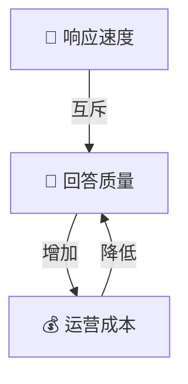

# 4. 业务规则与配置 (Business Rules and Configuration)

作为产品经理，了解系统的可配置参数非常重要。这些参数就像控制台上的旋钮，你可以通过调整它们来平衡系统的 **响应速度 (Speed)**、**回答质量 (Quality)** 和 **成本 (Cost)**。

所有核心配置都位于 `config/base_config.yaml` 文件中。

## 🎛️ 核心业务开关 (Key Business Toggles)

### 1. 智能体模式 (Agent Mode)
*   **配置项**: `triggers.mode`
*   **可选值**: `agent` (智能模式) / `noagent` (极速模式)
*   **业务含义**:
    *   **Agent (默认)**: 启用“慢思考”。系统会进行多步推理、问题拆解。适合复杂问题，但响应较慢。
    *   **No-Agent**: 启用“快直觉”。系统直接根据关键词搜索，不进行深层推理。适合简单查询，响应极快。

### 2. 知识构建粒度 (Chunk Size)
*   **配置项**: `construction.chunk_size`
*   **推荐值**: `1000` (字符数)
*   **业务含义**: 决定了我们“切蛋糕”的大小。
    *   **太大**: 可能导致 LLM 记不住细节，遗漏小实体。
    *   **太小**: 导致实体关系支离破碎，缺乏上下文，且增加 API 调用成本。

### 3. 检索深度 (Recall Paths)
*   **配置项**: `retrieval.recall_paths`
*   **推荐值**: `2`
*   **业务含义**: 决定了搜索时的“挖掘深度”。
    *   **值越高**: 系统会寻找更隐晦、间接的关系（如朋友的朋友的朋友）。
    *   **值越低**: 只关注直接关系。增加此值会显著增加检索时间。

### 4. 最大推理步数 (Max Steps)
*   **配置项**: `retrieval.agent.max_steps`
*   **推荐值**: `5`
*   **业务含义**: 限制智能体“思考”的次数。
    *   **防止死循环**: 如果问题太难，系统不会无限期地查下去。
    *   **成本控制**: 每一步都是一次 LLM 调用。

---

## ⚖️ 权衡分析 (Trade-off Analysis)

我们在设计产品时，往往需要在以下三个维度中做取舍。

### 场景推荐配置

| 业务场景 | 推荐配置组合 | 原因 |
| :--- | :--- | :--- |
| **实时客服机器人** | `mode: noagent` `top_k: 5` | 需要秒级响应，问题通常较简单直接。 |
| **深度研报分析** | `mode: agent` `recall_paths: 3` `max_steps: 8` | 用户愿意等待 10-30 秒，但要求极高的准确度和深度。 |
| **小说/剧本助手** | `chunk_size: 2000` `mode: agent` | 需要理解长距离的剧情关联，大文本块有助于保持连贯性。 |
| **大规模数据构建** | `max_workers: 64` `dataset_no_chunk: []` | 在后台批量处理数据时，拉满并发数以缩短构建时间。 |

---

## 📋 详细参数对照表

| 模块 | 参数名 | 默认值 | 业务解释 |
| :--- | :--- | :--- | :--- |
| **Construction** | `max_workers` | 32 | **构建并发数**: 越高越快，但对服务器压力越大。 |
| **Retrieval** | `top_k` | 20 | **候选数量**: 每次检索找回多少条相关信息。越多越全面，但干扰噪声也越大。 |
| **Retrieval** | `similarity_threshold` | 0.3 | **相似度门槛**: 低于这个分数的搜索结果会被丢弃。调高可减少“胡说八道”，调低可增加“联想能力”。 |
| **Tree Comm** | `struct_weight` | 0.3 | **社区结构权重**: 影响社区检测时对结构 vs 内容的侧重。 |

---
*这就完成了对 Youtu-GraphRAG 系统的深度业务梳理。希望这些文档能帮助您更好地规划产品路线图！*
